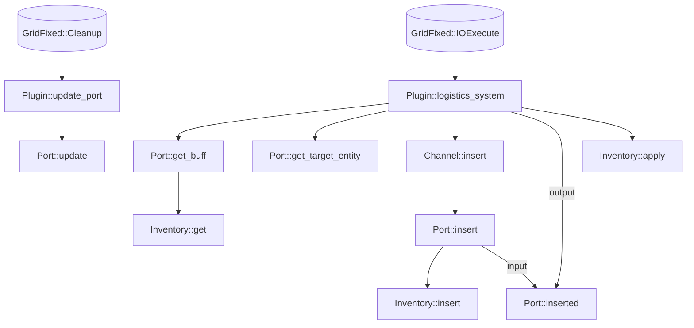

# 処理グラフ

```mermaid
graph TD;
    A[(GridFixed::IOExecute)] 
    G[(GridFixed::Cleanup)]
    B[Plugin::logistics_system]
    L[Plugin::update_port]
    C[Channel::insert]
    D[Port::get_buff] 
    E[Port::insert]
    N[Port::inserted]
    F[Port::update]
    M[Port::get_target_entity]
    J[Inventory::get]
    K[Inventory::apply]
    O[Inventory::insert]
    A --> B
    B --> D
    B --> M
    B --> C
    B -- output --> N
    B --> K
    D --> J
    E --> O
    E -- input --> N
    L --> F
    C --> E
    G --> L
```
